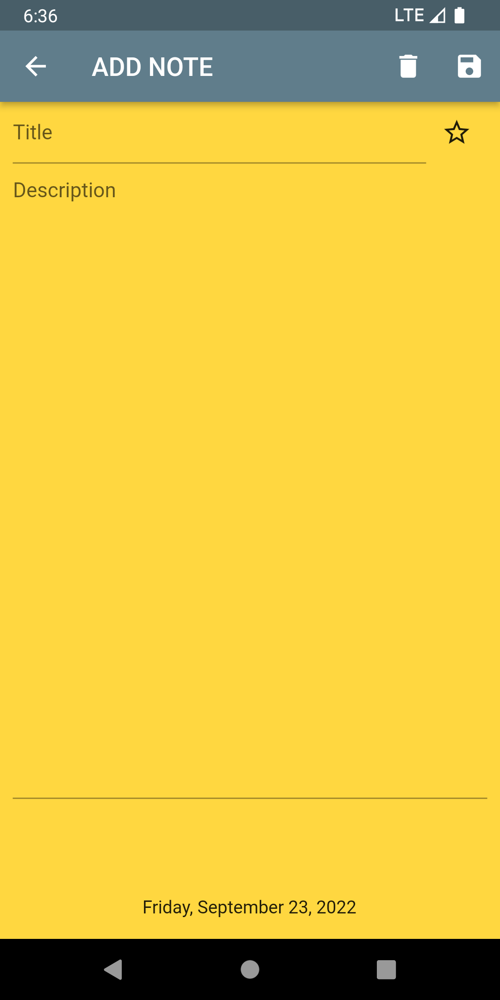

# SQLite Notepad

Hello there.
This is a simples notepad app developed in flutter.

This app was developed according to the classes of:

Flutter Tutorial - SQL Database Storage Using Sqlite & Sqflite CRUD | Android & iOS - Johannes Milke Youtube Chanel;

### Versions

- **Flutter**: 3.0.5
- **Dart**: 2.17.6

### Setup

Clone it in your machine:
```bash
git clone https://github.com/RodrigoNP3/SQLite_Notepad.git
```

Dependecies

```bash
dependencies:
  cupertino_icons: ^1.0.2
  sqflite: ^2.0.3+1
  flutter_staggered_grid_view: ^0.6.2
  intl: ^0.17.0
```

### Navigation

<table>
<thead>
<tr>
<th align="center">Home Screen</th>
<th align="center">Home Screen</th>
<th align="center">Add Note Screen</th>
  <th align="center">Edit Note Screen </th>

</tr>
</thead>
<tbody>
<tr>
  
<td align="center">
  <a target="_blank" rel="" href="images/Home_Screen.png">
        

  </a></td>
  
<td align="center">
  <a target="_blank" rel="" href="images/Home_Screen_2.png">
        

  </a></td>
  
  
<td align="center">
  <a target="_blank" rel="" href="images/ADD_EDIT_Screen.png">
        

  </a></td>
  
  
<td align="center">
  <a target="_blank" rel="" href="images/EDIT_NOTE.png">
        

  </a></td>
  
 
  <table>
<thead>
<tr>
<th align="center">Important Filter</th>
<th align="center">Not Important Filter</th>


</tr>
</thead>
<tbody>
<tr>
  
<td align="center">
  <a target="_blank" rel="" href="images/important_filter.png">
        

  </a></td>
  
<td align="center">
  <a target="_blank" rel="" href="images/not_important_filter.png">
        

  </a></td>
  
  